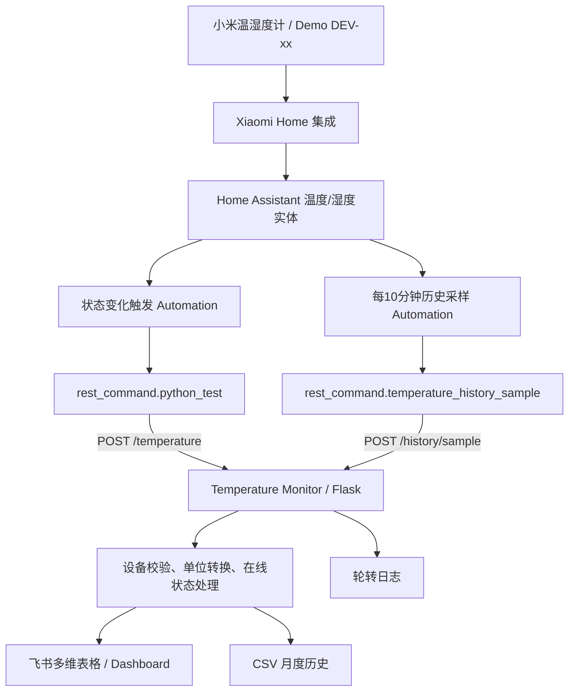

# Temperature Monitor

[](https://github.com/neilchen-dev/temperature-monitor/actions/workflows/tests.yml)

面向生产现场环境监控场景的轻量级数字化项目：通过 **Home Assistant + Python/Flask + REST API + 飞书多维表格**，将温湿度传感器数据、设备在线状态、现场作业登记、环境点检与异常记录串成一套可追溯的监测流程。

> 本仓库中的设备编号、区域名称、业务表单和展示数据均已脱敏或使用 Demo 数据。生产环境中的客户、人员、内部区域与平台凭据不包含在公开仓库中。

## 公开仓库安全说明

- `.env`、Home Assistant `secrets.yaml`、私钥文件和运行数据均已加入 `.gitignore`；请把真实凭据放在本地密钥管理系统或部署平台的 Secrets 中。
- `.env.example`、Add-on 配置和截图只保留占位符或 Demo 数据；`HISTORY_TABLE_MAP`、`DEVICE_RECORD_MAP` 等字段必须在部署时填写自己的资源 ID。
- 如果旧版本曾经提交过真实密钥、表 ID、record ID 或私有仓库信息，仅修改当前文件不会清除 Git 历史。请立即撤销/轮换相关凭据；需要彻底清理公开历史时，再单独执行经过备份和审核的历史重写。

## 项目亮点

- **IoT 数据接入**：Home Assistant 读取 Xiaomi Home 温湿度传感器状态，变化时自动上报。
- **后端服务**：Flask 提供 `POST /temperature` 接口，负责设备校验、单位转换与在线状态处理。
- **业务系统集成**：通过飞书开放 API 写入多维表格，实现现场数据实时更新与留痕。
- **状态判定**：支持由 Home Assistant 明确上报的在线/离线状态；离线上报不会覆盖最后一次有效温湿度。
- **Web HMI 监控台**：`/console` 三页签工业监控台（本地 Chart.js，无构建步骤）——实时监控（KPI + 三色状态设备卡片）、历史趋势（24h/7天/30天 + 控制区间上下限）、设备与事件（状态迁移翻译为用户可读时间线），支持**设备级温湿度控制区间设定**（`/api/thresholds`，阈值存本地 SQLite，超限自动高亮）。
- **定时历史快照**：Home Assistant 每十分钟调用一次 `POST /history/sample`，后端将实时总表的 11 台设备完整快照分别写入历史表，并按采集时间去重。
- **现场闭环**：多维表格 Demo 中包含监测记录、异常事件、作业登记、区域/点检等业务对象，并通过 Dashboard 汇总关键状态。
- **工程化运行**：Token 缓存与刷新、429/5xx/超时重试、CSV 历史记录、轮转日志、Waitress 与 Docker 部署。

## 业务 Demo

公开展示版使用 `DEV-xx`、`Area-x`、`Storage-x` 等匿名标识重建现场环境监控场景，主要包含：

1. **实时监测台账**：设备编号、温湿度、更新时间、在线状态及区域映射；
2. **环境受控作业登记**：现场人员提交当前工艺、区域、监测点与备注，监测数据由系统侧自动记录；
3. **仓库环境点检**：现场确认监测系统、报警与仓储状态，无需重复手工抄录温湿度；
4. **环境监控 Dashboard**：汇总超限点位、监测点总数、在线点位及各点位温湿度与控制区间。

这部分用于展示 **“业务需求 → 数据模型 → 自动采集 → 状态判定 → 表单/点检 → Dashboard”** 的完整数字化链路，而非公开生产环境数据。

## 预览

| 监测数据表 | 环境监控面板 |
| --- | --- |
|  |  |

| 现场作业登记 | 仓库环境点检 |
| --- | --- |
|  |  |

## CI/CD

仓库使用 GitHub Actions 实现自动化测试与部署，流程如下：

```text
Pull Request ──> tests.yml（只测试，不部署）
main push     ──> tests.yml（自动测试）
                    │ 测试通过
                    ▼
               deploy.yml（workflow_run 触发）
                    ├── 构建 Docker 镜像（commit SHA + latest 双标签）
                    ├── 推送到配置的容器镜像仓库
                    ▼
               SSH 登录生产服务器
                    ├── 同步 compose.yaml
                    ├── 更新 .env 中的 IMAGE_TAG（保留其余配置）
                    ├── docker compose pull / up -d --wait
                    ▼
               GET /health 健康检查
                    ├── 成功 → 部署完成
                    └── 失败 → 自动回滚到上一个镜像并使 Actions 失败
```

服务器上的 `data/`（SQLite 数据）、`logs/`（日志）与 `.env`（飞书等业务凭据）在部署过程中始终保留，部署脚本不会执行 `docker compose down -v`、`git clean -fdx` 或任何删除数据的操作。

CD 依赖以下 GitHub Actions Secrets 和 Variables（只存名称于仓库文档，实际值配置在 GitHub Settings → Secrets and variables → Actions，绝不提交到 Git）：

| Secret | 说明 |
|---|---|
| `SERVER_HOST` | 生产服务器公网 IP |
| `SERVER_USER` | SSH 登录用户（例如 `root`） |
| `SERVER_SSH_KEY` | 专用于部署的 SSH 私钥（OpenSSH 格式） |
| `DEPLOY_PATH` | 服务器部署目录（例如 `/root/temperature-monitor`，内含 `compose.yaml`、`.env`、`data/`、`logs/`） |
| `REGISTRY_USERNAME` | 容器镜像仓库用户名 |
| `REGISTRY_PASSWORD` | 容器镜像仓库密码 |

另外配置以下 **Repository variables**，用于指定镜像仓库；具体地址不写入公开仓库：

| Variable | 说明 |
|---|---|
| `CONTAINER_REGISTRY` | 镜像仓库域名，例如 `ghcr.io` 或企业私有仓库域名 |
| `CONTAINER_IMAGE_NAME` | 镜像路径，例如 `your-org/temperature-monitor` |

镜像标签策略：每次 main 分支提交同时推送 `<commit SHA>` 与 `latest` 两个标签；生产部署始终使用精确 SHA 标签（写入服务器 `.env` 的 `IMAGE_TAG`），具备可追踪、可回滚、可审计的能力。正式发版时可额外推送 `1.2.x` 之类的版本号标签。

## Docker Compose 部署（Home Assistant Container）

部署者只需准备 Docker Desktop（Windows/macOS）或 Docker Engine（Linux）和自己的飞书应用凭据。项目不包含任何真实凭据。

1. 克隆仓库后，将 [`.env.example`](.env.example) 复制为 `.env`；先把 `IMAGE_REPOSITORY` 改成你自己的镜像地址，再填写 `APP_ID`、`APP_SECRET`、`APP_TOKEN`、`TABLE_ID` 和随机生成的 `HISTORY_API_KEY`。如需保护温度上报接口，同时设置 `TEMPERATURE_API_KEY`（见下方环境变量表）。程序默认按飞书表的“设备编号”字段自动识别 `record_id`。
2. Windows 用户双击或在 PowerShell 中运行：

   ```powershell
   .\deploy.ps1
   ```

   首次运行会自动创建 `.env` 模板；填写后再次运行即可启动。

3. Linux/macOS 或任意终端运行：

   ```bash
   docker compose pull
   docker compose up -d --remove-orphans --wait --wait-timeout 120
   ```

部署完成后访问 `http://localhost:5000/health`，返回 `{"status":"ok",...}` 即表示服务已启动。Compose 默认使用 `latest` 标签，便于手动快速启动；生产自动部署会通过 `IMAGE_TAG=<commit SHA>` 显式锁定精确版本。手动升级时先将 `.env` 中的 `IMAGE_TAG` 改为目标版本，再重复“拉取 + 启动”命令。

Home Assistant Container 不使用 Add-on 内部主机名。`rest_command` 中的 `<temperature-monitor-host>` 按 HA 容器网络模式填写：

- HA 使用 `network_mode: host`：填 `127.0.0.1`。
- HA 使用普通 bridge 网络：填 Docker 主机的局域网 IP，例如 `192.168.1.10`；不能填 `localhost`，因为它只代表 HA 容器自身。
- HA 与本服务加入同一个自定义 Docker 网络：填容器名 `temperature-monitor`。

服务端口已由 Compose 映射为宿主机的 `${PORT:-5000}`。部署 HA 配置前，先从 HA 容器所在网络确认 `http://<temperature-monitor-host>:5000/health` 可访问。

## 可选：Home Assistant Add-on

仅适用于 **Home Assistant OS / Supervised**；Home Assistant Container 用户可忽略本节。Add-on 默认根据仓库内的 Dockerfile 本地构建，不绑定任何私有镜像仓库。

1. 在 Home Assistant 中打开 **设置 → Add-ons → Add-on Store → 右上角菜单 → Repositories**。
2. 添加仓库：`https://github.com/neilchen-dev/temperature-monitor`。
3. 在 Add-on Store 选择 **Temperature Monitor**，点击 **Install**。
4. 在 Add-on 的 **Configuration** 页面填写飞书凭据和至少 32 字节的 `history_api_key`；默认使用 `device_id_field`（`设备编号`）自动识别每台设备的 `record_id`，点击 **Save** 后 **Start**。

如设备字段名称不是“设备编号”，将 `device_id_field` 改为你的字段名。如果 Home Assistant 上报的设备名与飞书表中的设备编号不同，使用 `device_name_map` 做名称映射，例如：

```json
{"sensor.warehouse_temp":"DEV-01","sensor.warehouse_humidity":"DEV-02"}
```

`device_record_map` 仍可选填，用于固定覆盖个别设备的自动识别结果：

```json
{"DEV-01":"recxxxxxxxxxxxx","DEV-02":"recyyyyyyyyyyyy"}
```

Add-on 启动后，Home Assistant 自动化应通过 Add-on 的**内部主机名**访问 `http://<addon-hostname>:5000/temperature`；健康检查为 `/health`。自定义 GitHub 仓库安装的 Add-on 内部主机名由 Home Assistant 按仓库生成，并非可靠的固定 `local-temperature-monitor`。请在下方 REST 命令中替换 `<addon-hostname>` 为当前安装实例分配的内部主机名。HA Container（无 Supervisor）不支持 Add-on，请使用上方 Docker Compose 部署方式。

## 系统架构



1. Home Assistant 在温度、湿度或在线状态改变时调用 `POST /temperature`。
2. 服务校验设备与数值，并依据 `SOURCE_TEMPERATURE_UNIT` 将温度统一为摄氏度。
3. 最新状态写入飞书多维表格，同时保留月度 CSV 和日志；离线事件只更新状态，不覆盖最后一次有效读数。
4. 每逢整十分钟，后端读取实时总表并向 TH-01 至 TH-11 历史表各写一条同时间点快照；重复请求不会重复写入。

## 界面预览

- [`docs/images/`](docs/images/)：监测记录、现场登记表单与仪表盘预览截图。

## 仓库结构

```text
homeassistant/       Home Assistant REST 命令与自动化示例
hassio/              Home Assistant Add-on 清单与说明
routes/              HTTP 路由与响应处理
services/            校验、飞书通信、令牌、重试、本地存储与工业采集
static/              本地前端资源（控制台页面与 Chart.js，无外网 CDN）
tools/               开发/演示用模拟器（Modbus 模拟 PLC 等，不进生产主进程）
docs/images/         README 预览截图
app.py               Flask 应用、日志和 Waitress 启动入口
config.py            环境变量、设备映射与运行目录配置
Dockerfile           容器化运行配置
```

## 本地运行

建议使用 Python 3.12：

```powershell
git clone https://github.com/neilchen-dev/temperature-monitor.git
cd temperature-monitor
python -m venv .venv
.\.venv\Scripts\Activate.ps1
python -m pip install -r requirements.txt
$env:APP_ID="your_feishu_app_id"
$env:APP_SECRET="your_feishu_app_secret"
$env:APP_TOKEN="your_bitable_app_token"
$env:TABLE_ID="your_table_id"
python app.py
```

健康检查：

```powershell
Invoke-RestMethod http://127.0.0.1:5000/health
```

## Docker Compose 说明

```bash
cp .env.example .env
# 编辑 .env 后执行
docker compose pull
docker compose up -d --remove-orphans --wait --wait-timeout 120
```

Compose 默认从 `.env` 中的 `IMAGE_REPOSITORY` 拉取 `latest` 镜像，无需在本地构建；服务器自动部署时会显式使用 `IMAGE_TAG=<commit SHA>`。更新容器建议执行 `docker compose pull` 后再执行 `docker compose up -d --remove-orphans --wait --wait-timeout 120`。CSV 历史与日志分别持久化到本地 `data/` 和 `logs/` 目录。停止服务请执行 `docker compose down`。凭据只能保存在 `.env` 或密钥管理服务中，切勿提交该文件。

容器以非 root 用户（uid/gid 1000）运行：自动部署脚本会在启动前将宿主 `data/`、`logs/` 的属主修正为 1000；手动部署时若目录已存在且属主不是 1000，请先执行 `sudo chown -R 1000:1000 data logs`，否则容器内无法写入 SQLite 与日志。Compose 已为容器 stdout 配置 `json-file` 日志轮转（10MB × 3 个文件），应用自身文件日志另有独立的轮转配置。

如需回滚，在 `.env` 中设置上一稳定版本（例如 `IMAGE_TAG=1.0.3`），然后重新执行拉取和启动命令。`HISTORY_CLEANUP_ENABLED` 只从部署配置读取；第一阶段必须为 `false`，修改后需要重建容器才会生效。

## 环境变量

| 变量 | 必填 | 默认值 | 说明 |
|---|---:|---|---|
| `IMAGE_REPOSITORY` | Compose 部署时是 | `your-registry.example.com/your-namespace/temperature-monitor` | Docker 镜像完整仓库路径；请替换为自己的公开或私有仓库 |
| `IMAGE_TAG` | 否 | `latest` | Docker 镜像标签；生产部署使用 commit SHA |
| `APP_ID` | 是 | — | 飞书应用 ID |
| `APP_SECRET` | 是 | — | 飞书应用密钥 |
| `APP_TOKEN` | 是 | — | 飞书多维表格 App Token |
| `TABLE_ID` | 是 | — | 飞书数据表 ID |
| `HISTORY_API_KEY` | 使用历史采样时是 | — | `POST /history/sample` 的共享密钥，至少 32 字节 |
| `HISTORY_DEVICES` | 否 | `TH-01,…,TH-11` | 参与历史采样的设备列表（逗号分隔）；覆盖时 `HISTORY_TABLE_MAP` 必须与之一致 |
| `TEMPERATURE_API_KEY` | 否 | 空 | `POST /temperature` 的可选共享密钥；设置后请求必须携带 `X-Temperature-Key`（或 `X-History-Key`）头，留空则不鉴权以兼容旧配置。生产环境建议设置 |
| `MAX_CONTENT_LENGTH` | 否 | `16384` | 请求体大小上限（字节），超限返回 413 |
| `HISTORY_TABLE_MAP` | 使用历史采样时是 | 空 | JSON 格式的 TH-01～TH-11 到历史表 ID 的完整映射 |
| `HISTORY_INTERVAL_MINUTES` | 否 | `10` | 历史采样去重时间桶分钟数；需与 HA 自动化一致 |
| `HISTORY_TIMEZONE` | 否 | `Asia/Shanghai` | 历史采样与清理截止日使用的时区 |
| `HISTORY_CLEANUP_ENABLED` | 否 | `false` | 是否真正删除过期记录；第一阶段必须保持 `false` |
| `HISTORY_RETENTION_DAYS` | 否 | `90` | 历史记录保留天数 |
| `HISTORY_CLEANUP_HOUR` | 否 | `2` | 每日首次执行清理检查的本地小时 |
| `DEVICE_RECORD_MAP` | 否 | 空 | JSON 格式的设备名到飞书 record ID 手动覆盖，例如 `{"DEV-01":"recxxx"}` |
| `DEVICE_ID_FIELD` | 否 | `设备编号` | 自动识别 record ID 时，在飞书表中匹配设备名的字段 |
| `DEVICE_NAME_MAP` | 否 | 空 | JSON 格式的 Home Assistant 上报名到飞书设备编号映射，例如 `{"sensor.warehouse_temp":"DEV-01"}` |
| `SOURCE_TEMPERATURE_UNIT` | 否 | `C` | 上报温度单位：`F` 或 `C` |
| `HOST` | 否 | `0.0.0.0` | HTTP 监听地址 |
| `PORT` | 否 | `5000` | HTTP 监听端口 |
| `USE_SYSTEM_PROXY` | 否 | `false` | 飞书请求是否读取系统代理 |
| `REQUEST_TIMEOUT_SECONDS` | 否 | `10` | 单次 HTTP 请求超时秒数 |
| `REQUEST_RETRY_TIMES` | 否 | `3` | HTTP 请求最大尝试次数 |
| `WAITRESS_THREADS` | 否 | `4` | Waitress 工作线程数 |
| `DATA_DIR` | 否 | `/app/data`（Add-on 环境为 `/data`） | CSV 与 SQLite 数据目录 |
| `LOG_DIR` | 否 | `/app/logs` | 日志目录 |
| `SQLITE_ENABLED` | 否 | `true` | 是否启用 SQLite 本地镜像（温度上报与历史快照的本地副本，不影响飞书主链路） |
| `SQLITE_DB_PATH` | 否 | `${DATA_DIR}/temperature_monitor.db` | SQLite 数据库文件路径 |
| `MODBUS_ENABLED` | 否 | `false` | 是否启用 Modbus 采集；关闭时系统行为与引入该功能前完全一致 |
| `MODBUS_TRANSPORT` | 否 | `tcp` | 传输层：`tcp` 或 `rtu`（USB-RS485 / 串口）；两种传输输出同一套统一设备模型 |
| `MODBUS_HOST` / `MODBUS_PORT` | 否 | `127.0.0.1` / `5020` | TCP 专用目标地址（无硬编码，生产接真实 PLC 时修改此处） |
| `MODBUS_SERIAL_PORT` | `rtu` 时必填 | 空 | RTU 串口路径：Windows `COM3`，Linux `/dev/ttyUSB0`；断线重连仅在路径不变时自动恢复 |
| `MODBUS_BAUDRATE` / `MODBUS_PARITY` / `MODBUS_STOPBITS` / `MODBUS_BYTESIZE` | 否 | `9600` / `N` / `1` / `8` | RTU 串口参数 |
| `MODBUS_UNIT_ID` | 否 | `1` | Modbus 单元/从站 ID |
| `MODBUS_DEVICE_ID` | 否 | `PLC-01` | 该设备在统一设备模型中的设备编号 |
| `MODBUS_POLL_INTERVAL_SECONDS` | 否 | `5` | 轮询周期（秒，最小 1） |
| `MODBUS_TIMEOUT_SECONDS` | 否 | `5` | 单次读请求超时（秒，最小 1，两种传输共用） |
| `MODBUS_REGISTER_MAP` | 否 | 内置布局 | JSON 覆盖寄存器映射：温度/湿度必填，`device_status` 可选（省略时读取成功即在线）；每字段可配 `type: holding(FC03,默认)/input(FC04)`；非法时记录错误并禁用采集，不影响服务启动 |
| `EVENT_TEMPERATURE_HIGH_C` | 否 | 空（关闭） | 温度超过该摄氏度阈值时记录 `NORMAL -> TEMPERATURE_HIGH` 设备事件，回落后记录恢复事件 |

## SQLite 本地镜像与查询 API

服务在写入飞书的同时，将数据镜像到本地 SQLite（WAL 模式，默认 `data/temperature_monitor.db`）。设计原则：

- **飞书多维表格仍是唯一事实源**，SQLite 只是本地副本；初始化或写入失败只记日志并累加失败计数，绝不影响飞书链路、去重与清理逻辑；
- `SQLITE_ENABLED=false` 可整体关闭并快速回退；
- `history_snapshots` 以 `(设备, 采集时间)` 为复合主键，天然幂等；`temperature_reports` 是原始事件日志，允许 HA 重试产生重复行；
- 空温湿度为 NULL：设备离线（`online_status=离线`）与在线但数值不可解析两种情况通过 `online_status` 区分；
- 当前并发假设为**单进程单实例**（Waitress 多线程由内部锁保护）；数据库文件与 `-wal`/`-shm` 均落在同一 `data/` 持久卷内。

### 只读查询与统计接口

三个接口均需 `X-History-Key` 请求头（与历史采样共享密钥），镜像未启用时返回 503。

```bash
# 查询快照明细：支持 device / start / end（epoch 秒、毫秒或 ISO 8601）/ limit
curl -H "X-History-Key: $KEY" \
  "http://127.0.0.1:5000/history/query?device=TH-01&start=2026-08-18T00:00:00%2B08:00&limit=500"

# 每日统计：每设备每天的平均/最小/最大温湿度、离线次数、超限次数（离线样本不计入超限）
curl -H "X-History-Key: $KEY" \
  "http://127.0.0.1:5000/history/stats/daily?device=TH-01&days=7"

# 设备总览：最后快照值、快照数、上报次数、离线时长估算（离线样本数 × 采样间隔）
curl -H "X-History-Key: $KEY" "http://127.0.0.1:5000/history/stats/devices"
```

`GET /health` 的响应中包含 `sqlite` 对象（`enabled`、`write_failures`、两张表的行数），行数也可作为镜像是否落后于飞书的粗略指标。

### 可视化看板

浏览器访问 `http://127.0.0.1:5000/dashboard`，使用 `HISTORY_API_KEY` 登录后查看（`days` 可选，1～90），页面由服务端渲染，包含：

- **超限与离线趋势**：按天汇总的温度/湿度超限次数与离线次数；
- **各设备平均温湿度**：窗口期内每设备平均温度（°C）与平均湿度（%RH）双轴对比；
- **设备总览表**：最后快照值、在线状态、快照数、上报次数、最后快照/上报时间、估算离线时长。

登录采用签名 Cookie 会话：未登录访问返回登录页，密码即 `HISTORY_API_KEY`，密钥不出现在 URL 中（会话密钥从 `HISTORY_API_KEY` 派生，重启不掉线，轮换密钥全员下线）。程序化访问可用 `Authorization: Bearer <HISTORY_API_KEY>` 请求头；**不再支持 `?key=` 查询参数**，避免密钥泄漏到浏览器历史、书签与反向代理 access log。离线时长为估算值（离线样本数 × 采样间隔），漏采或停机会导致偏差。图表脚本（Chart.js 4.4.3）由服务本地 `/static/` 提供，无需外网 CDN。

### 工业监控台（/console）

浏览器访问 `http://127.0.0.1:5000/console`，在密钥栏输入 `HISTORY_API_KEY`（仅存 sessionStorage，通过 `X-History-Key` 请求头发送，不进 URL 与日志）。页面为单文件 SPA（本地 Chart.js，无构建步骤），三个功能页签：

- **实时监控**：设备/在线/离线/当前告警四项 KPI 与设备卡片墙。卡片按状态着色——绿色正常、黄色超控制区间、红色离线；10 秒自动刷新，「设定」按钮配置该设备的控制区间（温度 [-50, 100]°C、湿度 [0, 100]%RH，留空不限制），经 `PUT /api/thresholds/<device>` 持久化到本地 `device_thresholds` 表；
- **历史趋势**：设备下拉 + 24 小时 / 7 天 / 30 天窗口，温度与湿度两张趋势图，控制区间上下限以虚线绘制。主数据源为飞书业务快照（`/history/query`，10 分钟粒度，覆盖 30 天窗口），无快照的设备（如 Modbus 直采）自动回退到本地实时样本；点击监控页卡片可直接跳转；
- **设备与事件**：设备清单表（设备/来源/状态/温度/湿度/最后上报），点击行筛选右侧事件时间线。事件从 `device_events` 的状态迁移翻译为用户可读的文案（「温度超过阈值（30.1°C）」「设备恢复在线」等），把事件日志从代码细节变成产品功能。

页面壳不内嵌任何数据，与 `/health` 同级开放；所有数据请求仍需密钥鉴权，策略与查询 API 完全一致（未配置密钥 503、密钥错误 401、镜像禁用 503）。

## IIoT 数据采集（实验性）：Modbus TCP 与统一设备模型

在原有 HA 上报链路之外，服务可将 **Modbus** 数据源（PLC、温湿度网关、RS485 变送器等）接入统一的设备模型，与 HA 设备共用同一份存储与查询接口。支持两种传输，输出完全一致：

```text
PLC / Modbus TCP Server ──┐      RS485 温湿度变送器 ──USB-RS485──┐
        ↓ 轮询（后台线程）  │              ↓ 轮询（同一套代码）    │
        └────────────────┴── Modbus 采集器 (pymodbus, TCP/RTU) ──┘
                                     ↓
                     统一设备样本 device_samples（SQLite）
                                     ↓
        GET /api/devices · /api/events · /api/system/status
```

- **默认关闭**：`MODBUS_ENABLED=false` 时不创建采集线程，系统行为与引入本功能前完全一致。
- **TCP 与 RTU 同构**：`MODBUS_TRANSPORT=tcp|rtu` 切换传输；RTU 走 USB-RS485 串口（`MODBUS_SERIAL_PORT`），断线自动重连仅在串口路径不变时有效，COM 号/ttyUSB 编号变化需更新配置重启。
- **无硬件演示**：`python tools/modbus_simulator.py --port 5020` 启动本地模拟 PLC（温度 18~33°C 正弦漂移、湿度 40~70%、状态字可切换），随后在 `.env` 中设置 `MODBUS_ENABLED=true` 并重启服务即可。
- **新设备探针**：`python tools/modbus_probe.py --tcp HOST:PORT` 或 `--rtu COM3` 单次读取并打印统一样本；`--scan`（显式启用）逐个试探 unit id 1~16，帮助配置新买的 RS485 变送器。
- **寄存器映射**：`MODBUS_REGISTER_MAP` 支持每字段 `type: holding(FC03,默认)/input(FC04)`；`device_status` 可省略（无状态字的简易变送器读取成功即在线）。**address 是零基 PDU 地址**：手册中的 `40001`/`30001` 都对应 `address: 0`。稀疏地址自动分段读取（不会把 0 和 100 展开成 0..100 的连续请求）。同类型最多拆 16 个连续区间。
- **设备事件日志**：状态变化（`ONLINE -> OFFLINE` 等）只在变化瞬间写入 `device_events` 表，稳态轮询不产生重复记录；配置 `EVENT_TEMPERATURE_HIGH_C` 后可记录 `NORMAL -> TEMPERATURE_HIGH` 阈值事件。状态机身份是 `(设备, 数据源)`——HA 与 Modbus 共用同一设备编号时互不干扰状态判定。
- **故障隔离**：设备不在线、超时、非法寄存器值、短响应、串口拔出只记日志与稳定错误类别（`/api/system/status` 不含串口路径/IP），采集线程与 Flask 主服务互不影响；通信失败会主动关闭传输连接，串口路径不变时 USB 重插可自动恢复。
- **鉴权**：`/api/devices`、`/api/events` 与既有查询接口一致——未配置 `HISTORY_API_KEY` 返回 503，配置后需携带 `X-History-Key`（或 `Authorization: Bearer`）头。`/api/system/status` 与 `/health` 一样无鉴权，但只返回健康摘要。
- **容器/Add-on RTU**：Compose 需取消注释 `devices: [/dev/ttyUSB0:...]` 映射并按宿主 dialout gid 配置 `group_add`（见 compose.yaml 注释）；Home Assistant Add-on 已声明 `uart: true`（自动映射宿主机全部 UART/串口设备，无需逐个声明）；镜像内 appuser 已加入 dialout 组。
- **部署注意**：采集线程在单进程入口启动一次；若未来迁移 gunicorn 多 worker，只允许一个 worker 开启 `MODBUS_ENABLED`。一条 RS485 总线同一时刻只由一个采集线程使用（半双工）。

```bash
# 查看所有设备的统一状态（HA 与 Modbus 数据源并列；未配置 key 时返回 503）
KEY=<HISTORY_API_KEY>
curl -H "X-History-Key: $KEY" http://127.0.0.1:5000/api/devices

# 最近设备事件 / 系统状态
curl -H "X-History-Key: $KEY" "http://127.0.0.1:5000/api/events?limit=20"
curl http://127.0.0.1:5000/api/system/status
```

## Home Assistant 配置

参考 [`homeassistant/rest_command.yaml`](homeassistant/rest_command.yaml)、[`homeassistant/automation_th01.example.yaml`](homeassistant/automation_th01.example.yaml) 和 [`homeassistant/automation_history_sample.yaml`](homeassistant/automation_history_sample.yaml)。将 `homeassistant/secrets.example.yaml` 中的密钥项复制到 HA 的 `secrets.yaml`，并确保它与服务端 `HISTORY_API_KEY` 完全一致。

```yaml
rest_command:
  python_test:
    # HA 使用 host 网络时填 127.0.0.1；bridge 网络填 Docker 主机局域网 IP；
    # 两个容器共享自定义网络时填 temperature-monitor。
    url: "http://<temperature-monitor-host>:5000/temperature"
    method: POST
    headers:
      Content-Type: application/json
      # 服务端设置 TEMPERATURE_API_KEY 后取消注释启用鉴权
      # X-Temperature-Key: !secret temperature_monitor_temperature_api_key
    payload: >
      {
        "device": "{{ device }}",
        "temperature": "{{ temperature }}",
        "humidity": "{{ humidity }}"
      }

  temperature_history_sample:
    url: "http://<temperature-monitor-host>:5000/history/sample"
    method: POST
    headers:
      Content-Type: application/json
      X-History-Key: !secret temperature_monitor_history_api_key
    payload: "{}"
    timeout: 120
```

请求体示例：

```json
{
  "device": "DEV-01",
  "temperature": 24.6,
  "humidity": 52.0,
  "status": "online"
}
```

若未传 `status`，后端会按在线处理。默认 `SOURCE_TEMPERATURE_UNIT=C`；如果上游发送华氏温度，请将它设置为 `F`。

历史采样接口读取实时总表中的区域、温湿度、在线状态、温湿度判定、工艺、综合判定、作业状态和警报状态，再按 `HISTORY_TABLE_MAP` 写入对应历史表。同一十分钟时间桶重复调用会被跳过。第一阶段 `HISTORY_CLEANUP_ENABLED=false` 时会在任何过期记录筛选或删除 API 调用之前直接短路；观察稳定 24～48 小时并人工确认后，才能修改配置并重启服务启用清理。
