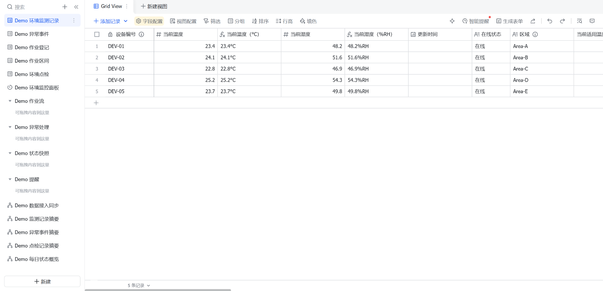
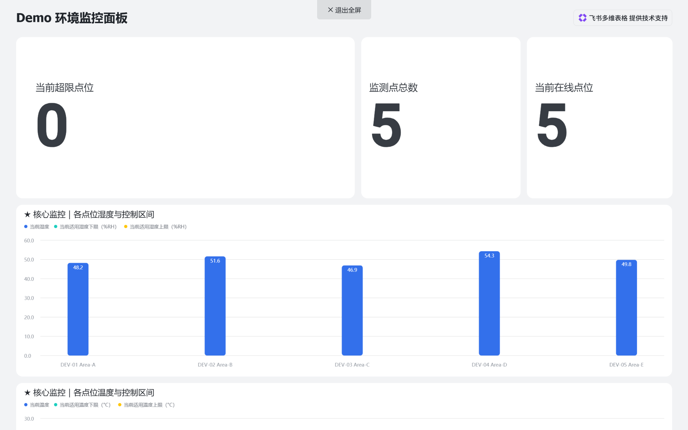
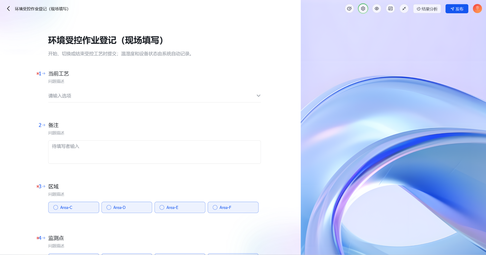
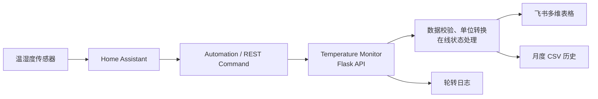

# Temperature Monitor

一个面向现场环境受控场景的温湿度监控服务示例。它接收 Home Assistant 上报的传感器数据，完成校验和单位转换后同步到飞书多维表格，并保留本地 CSV 历史记录及轮转日志。

> 本仓库仅包含公开演示所需的代码、截图和合成数据。设备编号、区域、业务流程与多维表格数据均已匿名化。

## 项目亮点

- **端到端链路**：Home Assistant → Flask API → 飞书多维表格 / CSV / 日志。
- **设备状态管理**：在线、离线状态独立处理；离线不会覆盖最后一条有效温湿度读数。
- **可靠的飞书写入**：访问令牌缓存和提前刷新，面对 `429`、`5xx`、连接超时自动指数退避重试。
- **可运维性**：月度 CSV 历史、控制台与文件轮转日志、Waitress 生产服务器，以及 Docker 部署支持。
- **公开 Demo**：提供可导入的脱敏飞书多维表格示例和实际界面截图。

## 预览

| 监测数据表 | 环境监控面板 |
| --- | --- |
|  |  |

| 现场作业登记 | 仓库环境点检 |
| --- | --- |
|  |  |

## 系统架构



1. Home Assistant 在温度、湿度或在线状态改变时调用 `POST /temperature`。
2. 服务校验设备与数值，并依据 `SOURCE_TEMPERATURE_UNIT` 将温度统一为摄氏度。
3. 最新状态写入飞书多维表格，同时保留月度 CSV 和日志；离线事件只更新状态，不覆盖最后一次有效读数。

## Demo 资源

- [`examples/temperature-monitor-demo.base`](examples/temperature-monitor-demo.base)：可导入的飞书多维表格公开示例，包含合成记录、仪表盘与演示流程。
- [`docs/images/`](docs/images/)：监测记录、现场登记表单与仪表盘预览截图。

`.base` 是飞书的迁移格式，可能包含平台自动生成的内部标识。本示例未包含 API 密钥、真实人员、客户、组织或生产数据；请不要将自己的生产 `.base` 文件直接公开。

## 仓库结构

```text
homeassistant/       Home Assistant REST 命令与自动化示例
routes/              HTTP 路由与响应处理
services/            校验、飞书通信、令牌、重试与本地存储
examples/            脱敏的飞书多维表格 Demo
docs/images/         README 预览截图
app.py               Flask 应用、日志和 Waitress 启动入口
config.py            环境变量、设备映射与运行目录配置
Dockerfile           容器化运行配置
```

## 本地运行

建议使用 Python 3.12：

```powershell
git clone https://github.com/zhengzhi65535-bot/temperature-monitor.git
cd temperature-monitor
python -m venv .venv
.\.venv\Scripts\Activate.ps1
python -m pip install -r requirements.txt
$env:APP_ID="your_feishu_app_id"
$env:APP_SECRET="your_feishu_app_secret"
$env:APP_TOKEN="your_bitable_app_token"
$env:TABLE_ID="your_table_id"
python app.py
```

健康检查：

```powershell
Invoke-RestMethod http://127.0.0.1:5000/health
```

## Docker 运行

```bash
docker build -t temperature-monitor:latest .

docker run -d \
  --name temperature-monitor \
  --restart unless-stopped \
  -p 5000:5000 \
  -e APP_ID="your_app_id" \
  -e APP_SECRET="your_app_secret" \
  -e APP_TOKEN="your_app_token" \
  -e TABLE_ID="your_table_id" \
  -v temperature-monitor-data:/app/data \
  -v temperature-monitor-logs:/app/logs \
  temperature-monitor:latest
```

凭据请通过环境变量或密钥管理服务注入，切勿写入代码、镜像构建参数或提交到仓库。

## 环境变量

| 变量 | 必填 | 默认值 | 说明 |
|---|---:|---|---|
| `APP_ID` | 是 | — | 飞书应用 ID |
| `APP_SECRET` | 是 | — | 飞书应用密钥 |
| `APP_TOKEN` | 是 | — | 飞书多维表格 App Token |
| `TABLE_ID` | 是 | — | 飞书数据表 ID |
| `SOURCE_TEMPERATURE_UNIT` | 否 | `F` | 上报温度单位：`F` 或 `C` |
| `HOST` | 否 | `0.0.0.0` | HTTP 监听地址 |
| `PORT` | 否 | `5000` | HTTP 监听端口 |
| `USE_SYSTEM_PROXY` | 否 | `false` | 飞书请求是否读取系统代理 |
| `REQUEST_TIMEOUT_SECONDS` | 否 | `10` | 单次 HTTP 请求超时秒数 |
| `REQUEST_RETRY_TIMES` | 否 | `3` | HTTP 请求最大尝试次数 |
| `WAITRESS_THREADS` | 否 | `4` | Waitress 工作线程数 |
| `DATA_DIR` | 否 | `/app/data` | CSV 目录 |
| `LOG_DIR` | 否 | `/app/logs` | 日志目录 |

## Home Assistant 配置

参考 [`homeassistant/rest_command.yaml`](homeassistant/rest_command.yaml) 和 [`homeassistant/automation_th01.example.yaml`](homeassistant/automation_th01.example.yaml)。其中实体 ID 与设备名称均为示例值，请替换为你自己的配置。

```yaml
rest_command:
  python_test:
    url: "http://local-temperature-monitor:5000/temperature"
    method: POST
    headers:
      Content-Type: application/json
    payload: >
      {
        "device": "{{ device }}",
        "temperature": "{{ temperature }}",
        "humidity": "{{ humidity }}"
      }
```

请求体示例：

```json
{
  "device": "DEV-01",
  "temperature": 24.6,
  "humidity": 52.0,
  "status": "online"
}
```

若未传 `status`，后端会按在线处理。默认 `SOURCE_TEMPERATURE_UNIT=F`；如果 Home Assistant 已发送摄氏温度，请将它设置为 `C`。
