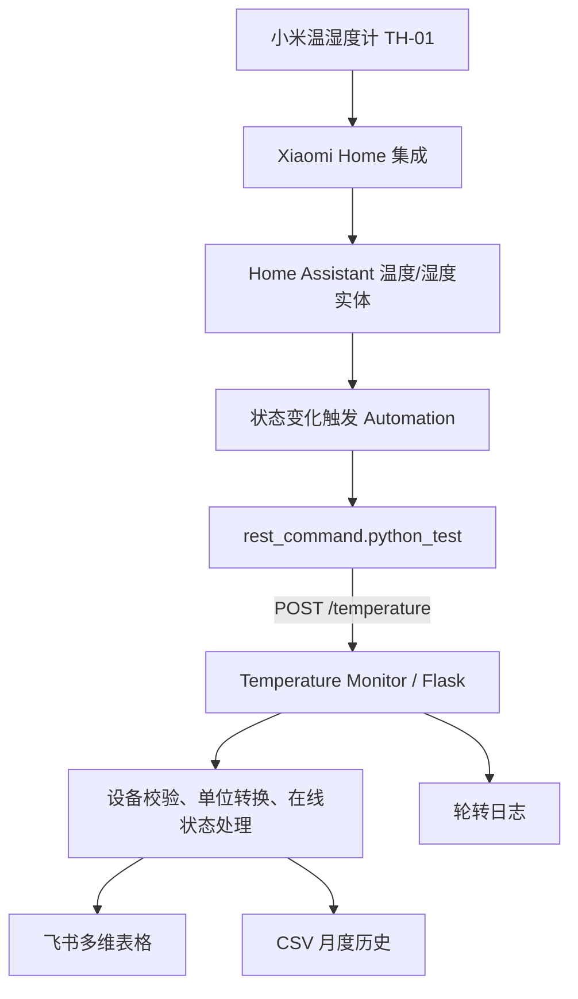

# Temperature Monitor

企业内部温湿度监控服务。接收 Home Assistant 上报的设备状态和温湿度，完成校验与华氏/摄氏转换后写入飞书多维表格，同时保留 CSV 历史记录和轮转日志。

本工程由已稳定运行的单文件版本进行结构化拆分，保留以下行为：

- `POST /temperature` 请求及响应兼容旧版；
- 未提供 `status` 时按“在线”处理；
- 离线时只更新飞书“在线状态”，不覆盖最后温湿度和更新时间；
- 飞书 Token 缓存、提前刷新和失效自动重试；
- HTTP 429、5xx、连接超时的指数退避重试；
- CSV 月度历史、INFO/ERROR 控制台及文件轮转日志；
- Waitress 生产服务器。

## 系统架构



数据链路分为三层：

1. Home Assistant 通过 Xiaomi Home 集成读取传感器实体；温度或湿度发生变化时，自动化调用 `rest_command.python_test`。
2. Flask 的 `POST /temperature` 接口校验设备与数值，并依据 `SOURCE_TEMPERATURE_UNIT` 统一转换为摄氏度。
3. 服务将最新状态写入飞书多维表格，同时把处理结果保存到月度 CSV 和轮转日志中。离线上报只更新在线状态，不覆盖最后一次有效读数。

仓库结构中的职责如下：

```text
homeassistant/       HA REST 命令与 TH-01 自动化示例
routes/              HTTP 路由与响应处理
services/            校验、飞书通信、Token、重试与本地存储
app.py               Flask 应用、日志和 Waitress 启动入口
config.py            环境变量、设备映射与运行目录配置
Dockerfile           容器化运行配置
```

## 本地运行

建议使用 Python 3.12：

```powershell
cd temperature-monitor
python -m venv .venv
.\.venv\Scripts\Activate.ps1
python -m pip install -r requirements.txt
$env:APP_ID="你的飞书应用ID"
$env:APP_SECRET="你的飞书应用密钥"
$env:APP_TOKEN="你的多维表格App Token"
$env:TABLE_ID="你的数据表ID"
python app.py
```

健康检查：

```powershell
Invoke-RestMethod http://127.0.0.1:5000/health
```

## Docker 运行

构建镜像：

```bash
docker build -t temperature-monitor:latest .
```

启动并挂载持久化目录：

```bash
docker run -d \
  --name temperature-monitor \
  --restart unless-stopped \
  -p 5000:5000 \
  -e APP_ID="your_app_id" \
  -e APP_SECRET="your_app_secret" \
  -e APP_TOKEN="your_app_token" \
  -e TABLE_ID="your_table_id" \
  -v temperature-monitor-data:/app/data \
  -v temperature-monitor-logs:/app/logs \
  temperature-monitor:latest
```

生产环境建议在云效中通过安全变量注入飞书凭据，构建完成后推送至阿里云 ACR。不要把凭据写入 Dockerfile、代码仓库或镜像构建参数。

## 环境变量

| 变量 | 必填 | 默认值 | 说明 |
|---|---:|---|---|
| `APP_ID` | 是 | 空 | 飞书应用 ID |
| `APP_SECRET` | 是 | 空 | 飞书应用密钥 |
| `APP_TOKEN` | 是 | 空 | 飞书多维表格 App Token |
| `TABLE_ID` | 是 | 空 | 飞书多维表格数据表 ID |
| `HOST` | 否 | `0.0.0.0` | HTTP 监听地址 |
| `PORT` | 否 | `5000` | HTTP 监听端口 |
| `SOURCE_TEMPERATURE_UNIT` | 否 | `F` | HA 上报单位，只能为 `F` 或 `C` |
| `USE_SYSTEM_PROXY` | 否 | `false` | 飞书请求是否读取系统代理 |
| `REQUEST_TIMEOUT_SECONDS` | 否 | `10` | 单次 HTTP 请求超时秒数 |
| `REQUEST_RETRY_TIMES` | 否 | `3` | HTTP 请求尝试次数 |
| `REQUEST_RETRY_BACKOFF_SECONDS` | 否 | `0.8` | 指数退避基数 |
| `TOKEN_REFRESH_MARGIN_SECONDS` | 否 | `300` | Token 提前刷新秒数 |
| `WAITRESS_THREADS` | 否 | `4` | Waitress 工作线程数 |
| `DATA_DIR` | 否 | `/app/data` | 容器内 CSV 目录 |
| `LOG_DIR` | 否 | `/app/logs` | 容器内日志目录 |

## Home Assistant 配置

可直接参考 [`homeassistant/rest_command.yaml`](homeassistant/rest_command.yaml) 和 [`homeassistant/automation_th01.example.yaml`](homeassistant/automation_th01.example.yaml)。自动化中的 `sensor.th01_temperature` 与 `sensor.th01_humidity` 是脱敏后的示例实体 ID，使用前请替换为 Home Assistant 中的真实实体。

REST 命令的核心配置如下：

```yaml
rest_command:
  python_test:
    url: "http://local-temperature-monitor:5000/temperature"
    method: POST
    headers:
      Content-Type: application/json
    payload: >
      {
        "device": "{{ device }}",
        "temperature": "{{ temperature }}",
        "humidity": "{{ humidity }}"
      }
```

示例配置没有传递 `status`；后端为了兼容现有 Home Assistant 配置，会将缺省状态视为“在线”。其他传感器可复制 TH-01 自动化，并替换设备名和两个实体 ID。

请求示例：

```json
{
  "device": "TH-01",
  "temperature": 86.0,
  "humidity": 60,
  "status": "在线"
}
```

默认 `SOURCE_TEMPERATURE_UNIT=F`，因此示例中的 `86.0` 会转换为 `30.0°C`。若 HA 已直接发送摄氏温度，请将该环境变量设为 `C`。

## CI/CD 目标链路

```text
Codeup → 云效流水线 → Docker Build → 阿里云 ACR → Home Assistant 拉取运行
```

云效流水线只需要在项目目录执行 Docker 构建并推送成品镜像。运行阶段在 Home Assistant Add-on 配置或容器环境中注入四个飞书环境变量，并持久化挂载 `/app/data` 与 `/app/logs`。
