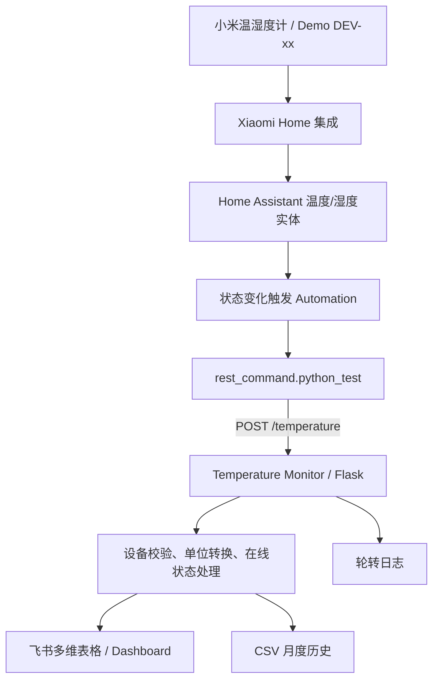

# Temperature Monitor

[](https://github.com/neilchen-dev/temperature-monitor/actions/workflows/tests.yml)


[](LICENSE)

面向生产现场环境监控场景的轻量级数字化项目：通过 **Home Assistant + Python/Flask + REST API + 飞书多维表格**，将温湿度传感器数据、设备在线状态、现场作业登记、环境点检与异常记录串成一套可追溯的监测流程。

> 本仓库中的设备编号、区域名称、业务表单和展示数据均已脱敏或使用 Demo 数据。生产环境中的客户、人员、内部区域与平台凭据不包含在公开仓库中。

## 项目亮点

- **IoT 数据接入**：Home Assistant 读取 Xiaomi Home 温湿度传感器状态，变化时自动上报。
- **后端服务**：Flask 提供 `POST /temperature` 接口，负责设备校验、单位转换与在线状态处理。
- **业务系统集成**：通过飞书开放 API 写入多维表格，实现现场数据实时更新与留痕。
- **状态判定**：支持由 Home Assistant 明确上报的在线/离线状态；离线上报不会覆盖最后一次有效温湿度。
- **现场闭环**：多维表格 Demo 中包含监测记录、异常事件、作业登记、区域/点检等业务对象，并通过 Dashboard 汇总关键状态。
- **工程化运行**：Token 缓存与刷新、429/5xx/超时重试、CSV 历史记录、轮转日志、Waitress 与 Docker 部署。

## 业务 Demo

公开展示版使用 `DEV-xx`、`Area-x`、`Storage-x` 等匿名标识重建现场环境监控场景，主要包含：

1. **实时监测台账**：设备编号、温湿度、更新时间、在线状态及区域映射；
2. **环境受控作业登记**：现场人员提交当前工艺、区域、监测点与备注，监测数据由系统侧自动记录；
3. **仓库环境点检**：现场确认监测系统、报警与仓储状态，无需重复手工抄录温湿度；
4. **环境监控 Dashboard**：汇总超限点位、监测点总数、在线点位及各点位温湿度与控制区间。

这部分用于展示 **“业务需求 → 数据模型 → 自动采集 → 状态判定 → 表单/点检 → Dashboard”** 的完整数字化链路，而非公开生产环境数据。

## 预览

| 监测数据表 | 环境监控面板 |
| --- | --- |
|  |  |

| 现场作业登记 | 仓库环境点检 |
| --- | --- |
|  |  |

## 一键部署

部署者只需准备 Docker Desktop（Windows/macOS）或 Docker Engine（Linux）和自己的飞书应用凭据。项目不包含任何真实凭据。

1. 克隆仓库后，将 [`.env.example`](.env.example) 复制为 `.env`；填写 `APP_ID`、`APP_SECRET`、`APP_TOKEN`、`TABLE_ID`。程序默认按飞书表的“设备编号”字段自动识别 `record_id`。
2. Windows 用户双击或在 PowerShell 中运行：

   ```powershell
   .\deploy.ps1
   ```

   首次运行会自动创建 `.env` 模板；填写后再次运行即可启动。

3. Linux/macOS 或任意终端运行：

   ```bash
   docker compose up -d
   ```

部署完成后访问 `http://localhost:5000/health`，返回 `{"status":"ok"}` 即表示服务已启动。更新版本时，在项目目录再次执行同一条命令即可。

## Home Assistant Add-on 一键安装

适用于 **Home Assistant OS / Supervised** 且为 `amd64`（Intel / AMD）主机。已配置为使用阿里云容器镜像：

```text
crpi-7apex3hoo0i4alz2.cn-hongkong.personal.cr.aliyuncs.com/noef-temperature/temperature-monitor:latest
```

1. 在 Home Assistant 中打开 **设置 → Add-ons → Add-on Store → 右上角菜单 → Repositories**。
2. 添加仓库：`https://github.com/neilchen-dev/temperature-monitor`。
3. 在 Add-on Store 选择 **Temperature Monitor**，点击 **Install**。
4. 在 Add-on 的 **Configuration** 页面填写飞书凭据；默认使用 `device_id_field`（`设备编号`）自动识别每台设备的 `record_id`，点击 **Save** 后 **Start**。

如设备字段名称不是“设备编号”，将 `device_id_field` 改为你的字段名。如果 Home Assistant 上报的设备名与飞书表中的设备编号不同，使用 `device_name_map` 做名称映射，例如：

```json
{"sensor.warehouse_temp":"DEV-01","sensor.warehouse_humidity":"DEV-02"}
```

`device_record_map` 仍可选填，用于固定覆盖个别设备的自动识别结果：

```json
{"DEV-01":"recxxxxxxxxxxxx","DEV-02":"recyyyyyyyyyyyy"}
```

Add-on 启动后，Home Assistant 自动化应通过 Add-on 的**内部主机名**访问 `http://<addon-hostname>:5000/temperature`；健康检查为 `/health`。自定义 GitHub 仓库安装的 Add-on 内部主机名由 Home Assistant 按仓库生成，并非可靠的固定 `local-temperature-monitor`。请在下方 REST 命令中替换 `<addon-hostname>` 为当前安装实例分配的内部主机名。HA Container（无 Supervisor）不支持 Add-on，请使用上方 Docker Compose 部署方式。

## 系统架构



1. Home Assistant 在温度、湿度或在线状态改变时调用 `POST /temperature`。
2. 服务校验设备与数值，并依据 `SOURCE_TEMPERATURE_UNIT` 将温度统一为摄氏度。
3. 最新状态写入飞书多维表格，同时保留月度 CSV 和日志；离线事件只更新状态，不覆盖最后一次有效读数。

## Demo 资源

- [`examples/temperature-monitor-demo.base`](examples/temperature-monitor-demo.base)：可导入的飞书多维表格公开示例，包含合成记录、仪表盘与演示流程。
- [`docs/images/`](docs/images/)：监测记录、现场登记表单与仪表盘预览截图。

`.base` 是飞书的迁移格式，可能包含平台自动生成的内部标识。本示例未包含 API 密钥、真实人员、客户、组织或生产数据；请不要将自己的生产 `.base` 文件直接公开。

## 仓库结构

```text
homeassistant/       Home Assistant REST 命令与自动化示例
hassio/              Home Assistant Add-on 清单与说明
routes/              HTTP 路由与响应处理
services/            校验、飞书通信、令牌、重试与本地存储
examples/            脱敏的飞书多维表格 Demo
docs/images/         README 预览截图
app.py               Flask 应用、日志和 Waitress 启动入口
config.py            环境变量、设备映射与运行目录配置
Dockerfile           容器化运行配置
```

## 本地运行

建议使用 Python 3.12：

```powershell
git clone https://github.com/neilchen-dev/temperature-monitor.git
cd temperature-monitor
python -m venv .venv
.\.venv\Scripts\Activate.ps1
python -m pip install -r requirements.txt
$env:APP_ID="your_feishu_app_id"
$env:APP_SECRET="your_feishu_app_secret"
$env:APP_TOKEN="your_bitable_app_token"
$env:TABLE_ID="your_table_id"
python app.py
```

健康检查：

```powershell
Invoke-RestMethod http://127.0.0.1:5000/health
```

## Docker Compose 说明

```bash
cp .env.example .env
# 编辑 .env 后执行
docker compose up -d
```

Compose 默认直接拉取已发布的 ACR 镜像，无需在本地构建。CSV 历史与日志分别持久化到本地 `data/` 和 `logs/` 目录。停止服务请执行 `docker compose down`。凭据只能保存在 `.env` 或密钥管理服务中，切勿提交该文件。

## 环境变量

| 变量 | 必填 | 默认值 | 说明 |
|---|---:|---|---|
| `APP_ID` | 是 | — | 飞书应用 ID |
| `APP_SECRET` | 是 | — | 飞书应用密钥 |
| `APP_TOKEN` | 是 | — | 飞书多维表格 App Token |
| `TABLE_ID` | 是 | — | 飞书数据表 ID |
| `DEVICE_RECORD_MAP` | 否 | 空 | JSON 格式的设备名到飞书 record ID 手动覆盖，例如 `{"DEV-01":"recxxx"}` |
| `DEVICE_ID_FIELD` | 否 | `设备编号` | 自动识别 record ID 时，在飞书表中匹配设备名的字段 |
| `DEVICE_NAME_MAP` | 否 | 空 | JSON 格式的 Home Assistant 上报名到飞书设备编号映射，例如 `{"sensor.warehouse_temp":"DEV-01"}` |
| `SOURCE_TEMPERATURE_UNIT` | 否 | `C` | 上报温度单位：`F` 或 `C` |
| `HOST` | 否 | `0.0.0.0` | HTTP 监听地址 |
| `PORT` | 否 | `5000` | HTTP 监听端口 |
| `USE_SYSTEM_PROXY` | 否 | `false` | 飞书请求是否读取系统代理 |
| `REQUEST_TIMEOUT_SECONDS` | 否 | `10` | 单次 HTTP 请求超时秒数 |
| `REQUEST_RETRY_TIMES` | 否 | `3` | HTTP 请求最大尝试次数 |
| `WAITRESS_THREADS` | 否 | `4` | Waitress 工作线程数 |
| `DATA_DIR` | 否 | `/app/data` | CSV 目录 |
| `LOG_DIR` | 否 | `/app/logs` | 日志目录 |

## Home Assistant 配置

参考 [`homeassistant/rest_command.yaml`](homeassistant/rest_command.yaml) 和 [`homeassistant/automation_th01.example.yaml`](homeassistant/automation_th01.example.yaml)。其中实体 ID 与设备名称均为示例值，请替换为你自己的配置。

```yaml
rest_command:
  python_test:
    # 将 <addon-hostname> 替换为当前 Add-on 安装实例的内部主机名。
    # 自定义 GitHub 仓库的名称并不固定为 local-temperature-monitor。
    url: "http://<addon-hostname>:5000/temperature"
    method: POST
    headers:
      Content-Type: application/json
    payload: >
      {
        "device": "{{ device }}",
        "temperature": "{{ temperature }}",
        "humidity": "{{ humidity }}"
      }
```

请求体示例：

```json
{
  "device": "DEV-01",
  "temperature": 24.6,
  "humidity": 52.0,
  "status": "online"
}
```

若未传 `status`，后端会按在线处理。默认 `SOURCE_TEMPERATURE_UNIT=C`；如果上游发送华氏温度，请将它设置为 `F`。
