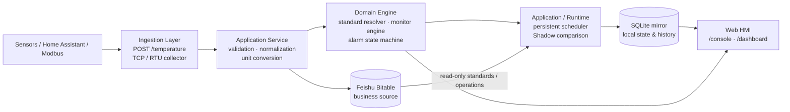

# Temperature Monitor

Industrial Environment Monitoring Platform

> A production-oriented environmental monitoring service integrating Home Assistant, Modbus RTU/TCP, Flask, SQLite, Feishu Bitable, and a web-based HMI.

[](https://github.com/neilchen-dev/temperature-monitor/actions/workflows/tests.yml) [](LICENSE)

Temperature Monitor 是一个面向工业现场的多源 IoT 环境监控平台。它接收 Home Assistant 或 Modbus 设备的温湿度数据，完成单位转换、设备状态判定、历史留存和事件记录，并将结果同步到飞书多维表格、本地 SQLite 和 Web 监控台。

仓库中的设备编号、区域名称、业务表单和展示数据均为脱敏或 Demo 数据。真实凭据、飞书资源 ID、Home Assistant secrets、数据库和日志不会提交到公开仓库。

## Preview

公开 Demo 使用 `DEV-xx`、`Area-x` 和 `Storage-x` 等匿名标识展示从数据采集到业务协同的闭环。

| Feishu monitoring records | Feishu environment dashboard |
| --- | --- |
|  |  |

| Field work form | Warehouse inspection form |
| --- | --- |
|  |  |

## Overview

平台解决的是一条完整的现场数据链路：

- 从 Home Assistant、Modbus TCP 或 Modbus RTU 接入环境数据；
- 以统一设备模型保存温度、湿度、在线状态和数据源；
- 通过状态迁移和可选温度阈值生成设备事件；
- 将业务数据同步到飞书，将本地副本写入 SQLite，支持历史查询和统计；
- 通过工业监控台查看实时状态、趋势、控制区间和事件时间线；
- 使用 Docker Compose 与 GitHub Actions 完成测试、构建、部署和失败回滚。

公开 Demo 当前配置了 11 个监测点。11 是示例部署规模，不是系统支持的设备数量上限；历史采样设备可以通过 `HISTORY_DEVICES` 配置。

## Architecture



Home Assistant 是一种数据源，不是系统架构中心。Modbus 采集器在后台轮询 TCP 或 RTU 设备，并把结果写入同一套设备样本、事件和查询接口。SQLite 是飞书业务数据的本地镜像，同时保存统一设备状态、阈值和事件；飞书多维表格仍是业务同步链路的事实源。

## Features

### Multi-source ingestion

- Home Assistant 通过 `POST /temperature` 上报温度、湿度和在线状态。
- Modbus collector 支持 TCP 与 USB-RS485/RTU，输出统一的设备样本。
- 支持摄氏和华氏输入，服务端统一保存为摄氏度。
- Home Assistant 设备名可以通过 `DEVICE_NAME_MAP` 映射到飞书中的设备编号。
- Modbus 读取失败、串口断开或寄存器数据非法时只隔离采集器，不阻塞 Flask 服务。

### Monitoring and event model

- 在线/离线状态只在发生变化时记录事件，稳定轮询不会制造重复事件。
- 可通过 `EVENT_TEMPERATURE_HIGH_C` 开启温度超限和恢复事件。
- 事件身份是“设备 + 数据源”，同一设备的 Home Assistant 与 Modbus 状态互不覆盖。
- 控制区间按设备保存在本地 SQLite，可分别设置温度和湿度上下限。

### Domain engine and Shadow Runtime

- Domain 层负责环境标准解析、监控结果、作业上下文和报警状态机，不依赖 Flask、SQLite 或飞书。
- Application 层编排样本处理、标准/作业同步、任务和动作审计。
- Runtime 层通过飞书只读适配器读取标准、作业、设备观察和异常事件，使用持久化调度器执行 Shadow 比对。
- 标准快照在完整读取和校验后再替换；任务、运行记录、事件和最新观察状态落盘，支持重启恢复和幂等处理。
- Shadow 只记录“应该发生什么”和“实际观察到什么”的差异，不修改既有飞书工作流。

### History and local analytics

- Home Assistant 默认每 10 分钟调用一次 `POST /history/sample`。
- 历史快照按设备和时间桶幂等写入，重复请求不会重复生成记录。
- SQLite 采用 WAL 模式，保存温度上报、历史快照、设备样本、事件和阈值。
- 提供快照明细、每日统计、设备总览和系统健康接口。
- 飞书或 SQLite 的局部失败会记录日志并暴露健康状态，便于排查同步延迟。

### Web HMI

访问 `/console` 可使用单文件工业监控台：

- **实时监控**：设备数量、在线状态、当前告警和设备卡片；
- **历史趋势**：24 小时、7 天和 30 天温湿度趋势，以及控制区间；
- **设备与事件**：设备来源、最后样本和状态迁移时间线；
- **控制区间**：直接在页面编辑设备的温湿度上下限。

访问 `/dashboard` 可查看服务端渲染的本地分析看板。页面脚本和 Chart.js 均从服务本地提供，不依赖外部 CDN。

## Data flow and API

常见数据流如下：

1. Home Assistant 在温度、湿度或在线状态变化时调用 `/temperature`。
2. 服务校验设备和数值，完成单位转换，并更新飞书实时记录。
3. 同一份数据镜像到 SQLite，并更新统一设备状态与状态迁移事件。
4. 每个整十分钟，Home Assistant 调用 `/history/sample`；服务读取实时表，为配置的监测点生成历史快照。
5. Modbus collector 按轮询周期读取设备，直接进入统一设备模型和本地查询链路。
6. Shadow Runtime 读取飞书只读数据，经过领域判定后持久化预期状态、运行结果和比对差异。

| Endpoint | Purpose | Auth |
| --- | --- | --- |
| `GET /health` | 服务与 SQLite 健康摘要 | 无 |
| `POST /temperature` | 接收 Home Assistant 温湿度上报 | `TEMPERATURE_API_KEY` 可选 |
| `POST /history/sample` | 生成历史快照 | `X-History-Key` |
| `GET /console` | 工业监控台 | 页面壳无；数据请求需 `X-History-Key` |
| `GET /dashboard` | 本地分析看板 | `HISTORY_API_KEY` 登录 |
| `GET /history/query` | 查询历史快照 | `X-History-Key` |
| `GET /history/stats/daily` | 按日统计温湿度和事件 | `X-History-Key` |
| `GET /history/stats/devices` | 设备快照和离线时长估算 | `X-History-Key` |
| `GET /api/devices` | 查询统一设备状态 | `X-History-Key` |
| `GET /api/events` | 查询设备事件 | `X-History-Key` |
| `GET /api/thresholds` / `PUT /api/thresholds/<device_id>` | 查询或写入设备控制区间 | `X-History-Key` |
| `GET /api/system/status` | 采集器和运行摘要 | 无 |

程序化访问查询 API 时使用 `X-History-Key`，也可以使用 `Authorization: Bearer <HISTORY_API_KEY>`。密钥不会通过 URL 传递。

## Runtime modes

自动化运行时通过 `AUTOMATION_MODE` 控制，Shadow 是监控平台中的一个高级能力，而不是项目的唯一定位：

- **`disabled`**：默认模式，不执行自动化动作；Home Assistant、历史同步和基础监控链路仍可运行；
- **`shadow`**：只读读取飞书业务状态，计算预期监控结果并与观察状态比对，持久化任务、运行记录和差异，不调用外部动作 handler；
- **`active`**：动作执行器保留该模式用于未来扩展，但当前 bootstrap 会主动拒绝 Active 接管，避免部署后静默修改现场业务。

此外，工业采集与本地镜像可以独立开关：

- **Modbus 模式**：开启 `MODBUS_ENABLED=true`，选择 `MODBUS_TRANSPORT=tcp` 或 `rtu`；
- **本地镜像**：`SQLITE_ENABLED=true` 时启用本地查询、控制台、事件、统计和 Shadow 持久化。

`SHADOW_DEVICE_IDS` 为空时不会处理任何 Shadow 设备。真正试运行前，应显式配置设备白名单、飞书只读表和 SQLite 持久化；Shadow 不会修改或关闭既有飞书工作流。

Modbus 采集线程只在 `python app.py` 的生产入口启动一次。若以后使用多进程服务器，只允许一个 worker 开启 `MODBUS_ENABLED`，避免重复轮询同一设备或 RS485 总线。

## Quick start

### Docker Compose

Docker Compose 默认拉取镜像，不在本地构建：

```bash
git clone https://github.com/neilchen-dev/temperature-monitor.git
cd temperature-monitor
cp .env.example .env
```

编辑 `.env`，至少填写飞书应用凭据和实时数据表信息：

```dotenv
IMAGE_REPOSITORY=your-registry.example.com/your-namespace/temperature-monitor
APP_ID=your_feishu_app_id
APP_SECRET=your_feishu_app_secret
APP_TOKEN=your_bitable_app_token
TABLE_ID=your_table_id
HISTORY_API_KEY=generate-a-random-key-at-least-32-bytes
```

启动服务：

```bash
docker compose pull
docker compose up -d --remove-orphans --wait --wait-timeout 120
curl http://127.0.0.1:5000/health
```

PowerShell 用户可以执行 `Copy-Item .env.example .env`，然后使用同样的 Compose 命令。Compose 将 `data/` 和 `logs/` 挂载到宿主机；容器以 uid/gid 1000 的非 root 用户运行，Linux 主机如遇写入权限问题，请执行：

```bash
sudo chown -R 1000:1000 data logs
```

### Local Python

本地开发建议使用 Python 3.12：

```bash
python -m venv .venv
source .venv/bin/activate       # Windows: .venv\\Scripts\\Activate.ps1
python -m pip install -r requirements.txt
cp .env.example .env
python app.py
```

服务启动后：

```text
Health check:  http://127.0.0.1:5000/health
Web HMI:      http://127.0.0.1:5000/console
Analytics:    http://127.0.0.1:5000/dashboard
```

## Configuration

完整变量和注释请参见 [`.env.example`](.env.example)。以下是部署时最重要的配置：

| Variable | Default | Description |
| --- | --- | --- |
| `IMAGE_REPOSITORY` | — | Compose 使用的完整镜像仓库路径 |
| `IMAGE_TAG` | `latest` | 镜像版本；自动部署使用 commit SHA |
| `APP_ID` / `APP_SECRET` | — | 飞书应用凭据 |
| `APP_TOKEN` / `TABLE_ID` | — | 飞书多维表格 App Token 和实时数据表 ID |
| `HISTORY_API_KEY` | — | 历史采样、查询 API 和控制台数据请求共享密钥，至少 32 字节 |
| `AUTOMATION_MODE` | `disabled` | 自动化运行模式：`disabled`、`shadow` 或 `active`；当前 bootstrap 拒绝 `active` |
| `SHADOW_DEVICE_IDS` | 空 | Shadow 处理的设备白名单；为空时不处理设备 |
| `SHADOW_DEVICE_CONTEXTS` | 空 | 设备上下文 JSON，可覆盖区域和控制类型 |
| `FEISHU_STANDARD_TABLE_ID` / `FEISHU_OPERATION_TABLE_ID` / `FEISHU_EVENT_TABLE_ID` | — | Shadow 只读链路使用的标准、作业和事件表 ID |
| `SHADOW_*_SECONDS` | 见 `.env.example` | Shadow 调度、作业同步、标准同步和飞书延迟窗口 |
| `TEMPERATURE_API_KEY` | 空 | 可选的温度上报接口共享密钥 |
| `HISTORY_DEVICES` | `TH-01,…,TH-11` | 历史采样设备列表；覆盖时必须同步配置 `HISTORY_TABLE_MAP` |
| `HISTORY_TABLE_MAP` | 空 | 设备编号到历史表 ID 的 JSON 映射 |
| `HISTORY_INTERVAL_MINUTES` | `10` | 历史采样去重时间桶 |
| `SQLITE_ENABLED` | `true` | 是否启用本地 SQLite 镜像和查询接口 |
| `SQLITE_DB_PATH` | `${DATA_DIR}/temperature_monitor.db` | SQLite 文件路径 |
| `PORT` | `5000` | HTTP 服务端口 |
| `MODBUS_ENABLED` | `false` | 是否开启 Modbus 后台采集 |
| `MODBUS_TRANSPORT` | `tcp` | `tcp` 或 `rtu` |
| `MODBUS_HOST` / `MODBUS_PORT` | `127.0.0.1` / `5020` | Modbus TCP 目标 |
| `MODBUS_SERIAL_PORT` | 空 | Modbus RTU 串口，如 `COM3` 或 `/dev/ttyUSB0` |
| `MODBUS_REGISTER_MAP` | 内置布局 | 温度、湿度及可选状态寄存器的 JSON 映射 |
| `EVENT_TEMPERATURE_HIGH_C` | 空 | 温度事件阈值；留空表示关闭温度阈值事件 |

`MODBUS_REGISTER_MAP` 中的 `address` 是零基 PDU 地址：手册中的 `40001` 或 `30001` 均应填写为 `0`，不要直接填写 `40001`。没有 PLC 硬件时，可以使用仓库内的模拟器：

```bash
python tools/modbus_simulator.py --port 5020
```

然后在 `.env` 中设置 `MODBUS_ENABLED=true` 并重启服务。使用 `python tools/modbus_probe.py --tcp HOST:PORT` 可以单次读取并检查寄存器映射。

## Home Assistant

### Home Assistant Container

参考 [`homeassistant/rest_command.yaml`](homeassistant/rest_command.yaml) 和 [`homeassistant/automation_history_sample.yaml`](homeassistant/automation_history_sample.yaml)。实时上报和历史采样分别调用：

```yaml
rest_command:
  temperature_monitor_report:
    url: "http://<temperature-monitor-host>:5000/temperature"
    method: POST
    headers:
      Content-Type: application/json
    payload: >
      {
        "device": "{{ device }}",
        "temperature": "{{ temperature }}",
        "humidity": "{{ humidity }}"
      }

  temperature_monitor_history:
    url: "http://<temperature-monitor-host>:5000/history/sample"
    method: POST
    headers:
      Content-Type: application/json
      X-History-Key: !secret temperature_monitor_history_api_key
    payload: "{}"
```

`<temperature-monitor-host>` 取决于容器网络：HA 使用 host 网络时通常为 `127.0.0.1`；普通 bridge 网络应填写 Docker 主机的局域网 IP；同一自定义网络中可以填写服务容器名。不要在 HA Container 中使用 `localhost` 代替 Docker 主机地址。

### Home Assistant OS / Supervised Add-on

项目同时提供可选 Add-on。它使用 GitHub Container Registry 的公开镜像，不适用于 Home Assistant Container：

1. 在 Add-on Store 的 Repositories 中添加 `https://github.com/neilchen-dev/temperature-monitor`；
2. 安装 **Temperature Monitor**；
3. 在 Configuration 中填写飞书凭据、`history_api_key` 和设备映射；
4. 保存后启动，并使用 Add-on 实例的内部主机名调用 `/temperature`、`/history/sample`。

Add-on 的版本来自 [`hassio/temperature-monitor/config.yaml`](hassio/temperature-monitor/config.yaml)。请只填写自己飞书空间中的表 ID 和 record ID，不要把真实资源 ID 提交到 Git。

## Deployment

GitHub Actions 将测试和部署分成两个阶段：

```text
Pull request / push
        │
        ▼
tests.yml
Python 3.12 · ruff · pytest
        │ main 分支测试成功
        ▼
deploy.yml（workflow_run）
构建并推送 <commit SHA> 与 latest 镜像
        │
        ▼
SSH → 更新服务器 IMAGE_TAG
     → docker compose pull / up --wait
     → GET /health
        │
        ├─ 成功：完成部署
        └─ 失败：恢复旧 IMAGE_TAG 并回滚
```

生产部署使用精确 commit SHA 作为 `IMAGE_TAG`，服务器上的 `.env`、`data/` 和 `logs/` 会被保留。部署脚本不会执行 `docker compose down -v` 或清理持久化数据。

部署 workflow 需要在 GitHub Actions 中配置以下 Secrets：`SERVER_HOST`、`SERVER_USER`、`SERVER_SSH_KEY`、`DEPLOY_PATH`、`ACR_USERNAME`、`ACR_PASSWORD`；并配置 Variables：`CONTAINER_REGISTRY`、`CONTAINER_IMAGE_NAME`。Add-on 发布 workflow 会在测试成功后，根据 `config.yaml` 中的版本发布 GHCR 镜像。

## Project structure

```text
domain/              Environment standards, monitor engine, alarm state machine
application/         Use cases, synchronization, action execution and Shadow comparison
integrations/        Feishu read-only adapters and external record normalization
repositories/        SQLite repositories for state, tasks, events and runtime audit
runtime/             Dependency bootstrap and persistent Shadow Runtime lifecycle
scheduler/           Durable local task scheduler
routes/              Flask HTTP routes: ingestion, history, analytics, API, HMI
services/            Feishu client, SQLite mirror, history, validation, Modbus
static/              Industrial console and local Chart.js asset
homeassistant/       REST commands and automation examples
hassio/              Home Assistant Add-on manifest and release metadata
tools/               Modbus simulator and register probe
tests/               Unit and integration tests
app.py               Flask application, logging, Waitress and runtime entry point
config.py            Environment variables and runtime configuration
compose.yaml         Docker Compose service definition
Dockerfile           Non-root Python container image
```

## Development and verification

安装依赖后运行与 CI 一致的检查：

```bash
python -m pip install -r requirements-dev.txt
ruff check .
python -m pytest
```

## Documentation

- [`.env.example`](.env.example)：完整配置模板和安全说明；
- [`overview.md`](overview.md)：项目调用链和三条数据链路概览；
- [`docs/project-deep-dive.md`](docs/project-deep-dive.md)：按真实调用链组织的深入说明；
- [`docs/domain-model.md`](docs/domain-model.md)：领域模型与规则边界；
- [`docs/development.md`](docs/development.md)：本地开发与测试约束；
- [`docs/feishu-mapping.md`](docs/feishu-mapping.md)：飞书业务字段与 Python 映射契约；
- [`homeassistant/`](homeassistant/)：Home Assistant 接入示例；
- [`hassio/temperature-monitor/`](hassio/temperature-monitor/)：Add-on 配置；
- [`docs/images/`](docs/images/)：脱敏后的飞书多维表格与业务 Demo 截图。

## License

[MIT](LICENSE)
